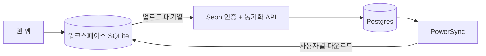

[English](./README.md) | 한국어
<br>

<div align="center">
  
  # Seon (선) 목표 관리
  
  <p>로컬 우선 목표 관리 애플리케이션<br>🚧 개발 진행 중 🚧</p>

</div>

## 소개

Seon(선)이라는 이름은 '선(線)'을 뜻하며, 진행 차트에 표시되는 궤적과 한 걸음씩 목표를 향해 나아가는 길, 두 가지의 의미를 담고 있습니다.

## 주요 기능

- 📱 프로그레시브 웹 앱 (PWA) - 모바일과 데스크톱 지원
- 💾 로컬 우선 아키텍처 - 서버 없이 완전한 오프라인 작동
- ⚡ 로컬 CRUD를 통한 즉각적인 UI 반응
- 🔄 선택적 동기화 기능
- 📊 시각적 목표 추적
- 🌐 다국어 지원 (한국어, 영어, 포르투갈어)

## 아키텍처

Seon은 워크스페이스별 SQLite를 주 데이터 저장소로 사용하는 로컬 우선 앱입니다. 모든 CRUD 작업은 먼저 브라우저에서 실행되므로 서버 없이도 사용할 수 있으며, 로그인은 선택적 동기화만 활성화합니다.

인증은 HttpOnly 쿠키 기반의 취소 가능한 Better Auth 데이터베이스 세션을 사용하며, 15분 서명 쿠키 캐시로 서버 조회를 줄입니다. 브라우저는 액세스 토큰, 리프레시 토큰, 데이터베이스 자격 증명을 저장하지 않습니다. 업로드는 공급자 중립적인 Seon 동기화 API를 거치고, PowerSync는 현재 사용자별 변경 사항 다운로드를 담당합니다. 브라우저에는 로컬 또는 계정 연결 워크스페이스 하나만 활성화됩니다.<br><br>



## 기술 스택

<table>
<tr>
  <td><b>프론트엔드</b></td>
  <td><b>백엔드</b></td>
  <td><b>동기화</b></td>
</tr>
<tr valign="top">
  <td>
    • React + Vite<br>
    • TypeScript<br>
    • Tanstack Router<br>
    • TailwindCSS<br>
    • Radix UI<br>
    • Chart.js<br>
    • SQLite (wa-sqlite)<br>
    • Vite PWA<br>
    • Lingui (다국어)
  </td>
  <td>
    • Hono<br>
    • PostgreSQL<br>
    • Drizzle ORM<br>
    • Better Auth<br>
    • Resend 이메일 어댑터
  </td>
  <td>
    • Seon 동기화 API<br>
    • PowerSync
  </td>
</tr>
</table>

## 시작하기

### 필수 조건

- Node.js 24
- pnpm 11

### 설치

1. 저장소 복제:

```sh
git clone [repo-url]
```

2. 디펜던시 설치:

```sh
pnpm install
```

3. 애플리케이션 실행:

```sh
pnpm --filter web build
pnpm --filter web serve
```

개발 환경에서는 `packages/server/.env.example`과
`packages/web/.env.local.example`을 복사해 설정하세요. 운영 환경에는
Cloudflare Pages의 `API_ORIGIN` 런타임 변수와
`packages/server/powersync/README.md`에 설명된 PowerSync 설정도 필요합니다.
