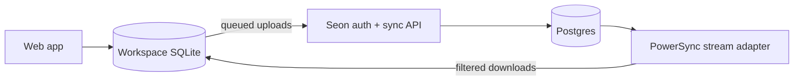

English | [한국어](./README.ko-kr.md)
<br>

<div align="center">
  
  # Seon Goals
  
  <p>A local-first goal management application.<br>🚧 Under development 🚧</p>

</div>

## About

The name Seon, Korean for "line" (선), relates to the trajectory shown in the progress charts and suggests a path towards achievement, one step at a time.

## Features

- 📱 Progressive Web App (PWA) - support for mobile and desktop
- 💾 Local-first architecture - works completely offline, no server needed
- ⚡ Instant UI responses with local CRUD
- 🔄 Optional sync capabilities
- 📊 Visual goal tracking
- 🌐 Multi-language support (English, Korean, Portuguese)

## Architecture

Seon uses a local-first architecture: every goal and entry operation executes
against a workspace-specific SQLite database. The app remains usable without a
server; signing in only enables optional synchronization.

Authentication uses revocable Better Auth database sessions in HttpOnly
cookies, with a 15-minute signed cookie cache to avoid a database read on every
request. The browser never stores access or refresh tokens. It also never talks
directly to Postgres: queued uploads go through Seon's authenticated,
provider-neutral sync API, while PowerSync currently supplies filtered change
downloads. A browser stores exactly one local or account-bound workspace at a
time.<br><br>



## Tech Stack

<table>
<tr>
  <td><b>Frontend</b></td>
  <td><b>Backend</b></td>
  <td><b>Sync</b></td>
</tr>
<tr valign="top">
  <td>
    • React + Vite<br>
    • TypeScript<br>
    • Tanstack Router<br>
    • TailwindCSS<br>
    • Radix UI<br>
    • Chart.js<br>
    • SQLite (wa-sqlite)<br>
    • Vite PWA<br>
    • Lingui (i18n)
  </td>
  <td>
    • Hono<br>
    • PostgreSQL<br>
    • Drizzle ORM<br>
    • Better Auth<br>
    • Resend-compatible email adapter
  </td>
  <td>
    • Seon sync HTTP API<br>
    • PowerSync stream adapter
  </td>
</tr>
</table>

## Getting Started

### Prerequisites

- Node.js 24
- pnpm 11

### Installation

1. Clone the repository:

```sh
git clone [repo-url]
```

2. Install dependencies:

```sh
pnpm install
```

3. Run the application:

```sh
pnpm --filter web build
pnpm --filter web serve
```

Copy `packages/server/.env.example` and `packages/web/.env.local.example` for
development. Production also needs the Cloudflare Pages `API_ORIGIN` runtime
variable and the PowerSync configuration documented in
`packages/server/powersync/README.md`.
